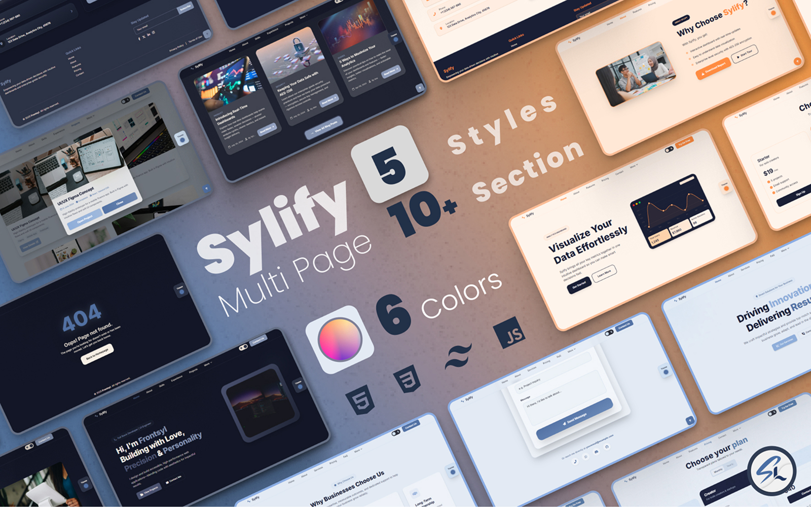
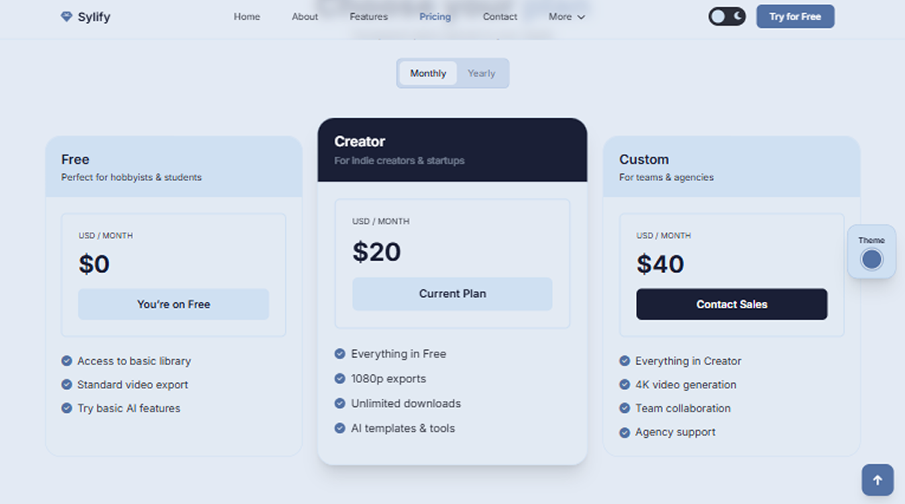
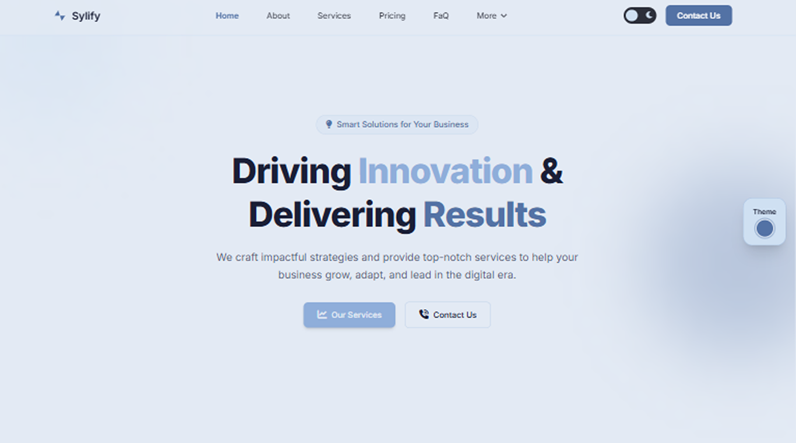

# Sylify — Premium Tailwind Corporate Website Template
Modern. Elegant. Enterprise‑Ready.

  

  
  

  
  
  
  

---

## Overview

**Sylify** is a premium **corporate & business website template** meticulously crafted with **Tailwind CSS v4**.  
Built for agencies, SaaS, startups, and enterprises, Sylify focuses on:

- pixel-perfect structure
- 100vh premium hero sections
- modern blue/white corporate aesthetic
- clean layout hierarchy
- dark mode elegance

## 📦 Package Includes
- **5 complete multi‑page websites** in 1 package
- **6 professional color themes** for each website
- Designed for **agencies, SaaS, startups, corporate teams, and enterprise products**

If you need a **high-end business website** without designers or frontend developers, Sylify gives you a production‑grade solution.

---

## ✨ Key Features

- ⚡ **Powered by Tailwind CSS v4**
- 🌙 **Modern Dark Mode Included**
- 📱 Fully responsive across all devices
- 🧩 Pixel-perfect premium layout
- 🎨 Enterprise-grade UI design
- 🏢 Ideal for Business, Corporate, SaaS, and Agencies
- 🔍 SEO‑optimized structure
- 🚀 Fast-loading, clean HTML
- 🧭 100vh Hero & premium spacing

---

## 📸 Template Previews
*A visual-first template built with premium clarity.*

### Hero Section – Premium SaaS Dashboard Layout

---

### Pricing Section – Glassmorphism Cards

---

### Business Hero – Corporate Landing Layout

---

### Contact Section – Clean & Minimal UI

> This repository contains **visual previews only**.  
> Full source code is available exclusively on TemplateMonster.

---

## 💼 Why Choose Sylify?

### 1. Built for Real Business Needs
Based on enterprise UX patterns used by **Metronic**, **Cuba Tailwind**, and **Canvas**.

### 2. Ultra‑Premium Layout Quality
Consistent spacing, luxury dark mode, modern typography, and professional color contrast.

### 3. Save Time, Cost, and Complexity
You skip:
- ❌ designer fees
- ❌ frontend development
- ❌ endless revisions  
- ❌ starting from zero

Sylify gives you a professional website base **ready in minutes**, not weeks.

---

## 📦 What’s Included in the Full Version?

- Full Tailwind CSS 4 source code
- Light & dark mode presets
- Corporate hero + CTA
- Services & Features
- Pricing (glassmorphism)
- Testimonials
- About / Story
- Contact UI
- Mobile navigation
- Tailwind theming variables
- AOS + Swiper integrations

---

## 🛒 Get Sylify

  <a href="https://www.templatemonster.com/website-templates/sylify-modern-multipurpose-website-templates-543980.html" target="_blank"><strong>🛒 Buy Sylify on TemplateMonster</strong></a>

---

## 🧩 Tech Stack
- Tailwind CSS v4
- HTML (semantic, clean)
- Dark Mode & Variable Theming
- Google Fonts — Inter
- AOS Animations
- SwiperJS

---

## License
This repository contains **preview assets only**.  
Full licensed source code is distributed only through TemplateMonster.

---

  © 2025 Sylify — Premium Business & Corporate Template by FrontSyl

